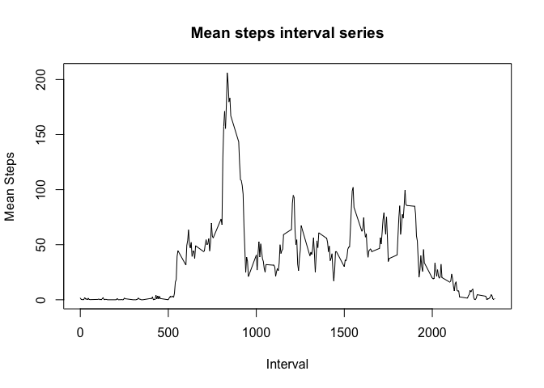

# Reproducible Research: Peer Assessment 1

#Number of steps per interval analysi

###Data Source: https://github.com/rdpeng/RepData_PeerAssessment1

## Loading and preprocessing the data

```r
library(car)
library(plyr)
setwd("~/datasciencecoursera/reproducible/RepData_PeerAssessment1-master")
df.activity <- read.csv("activity.csv", sep=",", stringsAsFactors=FALSE, as.is=T)
df.activity$date.new <- as.Date(as.character(df.activity$date), "%Y-%m-%d")
##Removing NA from dataframe
df.activity.clean <- df.activity[complete.cases(df.activity[,"steps"]),]
```

## What is mean total number of steps taken per day?

```r
library(dplyr)
```

```
## 
## Attaching package: 'dplyr'
## 
## The following objects are masked from 'package:plyr':
## 
##     arrange, count, desc, failwith, id, mutate, rename, summarise,
##     summarize
## 
## The following object is masked from 'package:stats':
## 
##     filter
## 
## The following objects are masked from 'package:base':
## 
##     intersect, setdiff, setequal, union
```

```r
by_day_steps <- group_by(df.activity.clean, date)

steps_per_day <- summarize(by_day_steps,                      
                                   DaySteps = sum(steps))

hist(steps_per_day$DaySteps, col = "green", main = "Total number of steps per day", xlab="Steps")
```

 

```r
mean(steps_per_day$DaySteps)
```

```
## [1] 10766.19
```

```r
median(steps_per_day$DaySteps)
```

```
## [1] 10765
```

## What is the average daily activity pattern?

```r
by_interval_steps <- group_by(df.activity.clean, interval)

steps_per_interval <- summarize(by_interval_steps,                      
                           IntervalMSteps = mean(steps))

with(steps_per_interval, plot(interval, IntervalMSteps, main="Mean steps interval series", 
                            xlab="Interval", ylab="Mean Steps", pch=19,  type = "l", 
                            ))
```

 

```r
df.maxstep <- steps_per_interval[steps_per_interval$IntervalMSteps == max(steps_per_interval$IntervalMSteps), ]

df.maxstep$interval
```

```
## [1] 835
```


## Imputing missing values
To fill the NAs, I used the average number of step per 5 minutes interval.  
Firstly, I applied a left join to the dataframe of means and the dataframe of original data by interval key.  
Secondly, with the ifelse function, I filled the missing number with the correspondent mean, otherwise I put
the original datum

```r
sum(is.na(df.activity$steps))
```

```
## [1] 2304
```

```r
meanjoin<-join(df.activity, steps_per_interval, by = "interval", type = "left", match = "all")
meanjoin$newmeanstep <- ifelse(is.na(meanjoin$steps)==TRUE, meanjoin$IntervalMSteps, meanjoin$steps)
by_day_steps_new <- group_by(meanjoin, date)

steps_per_day_new <- summarize(by_day_steps_new,                      
                           DayStepsNew = sum(newmeanstep))


hist(steps_per_day_new$DayStepsNew, col = "green", main = "Total number of steps per day (imputing strategy)", xlab="Steps")
```

 

```r
mean(steps_per_day_new$DayStepsNew)
```

```
## [1] 10766.19
```

```r
median(steps_per_day_new$DayStepsNew)
```

```
## [1] 10766.19
```


## Are there differences in activity patterns between weekdays and weekends?

```r
meanjoin$weekday <- weekdays(meanjoin$date.new)
meanjoin$weekend <- revalue(meanjoin$weekday, c("Lunedì"="Weekday", "Martedì"="Weekday", "Mercoledì"="Weekday", "Giovedì"="Weekday", "Venerdì"="Weekday", "Sabato"="Weekend", "Domenica"="Weekend"))

by_interval_steps_mean <- group_by(meanjoin, interval, weekend)

steps_per_interval_mean <- summarize(by_interval_steps_mean,                      
                                     patternmean = mean(newmeanstep))


library(ggplot2)
g <- ggplot(steps_per_interval_mean, aes(interval, patternmean)) 
g + geom_line(colour="blue", size=1.5) + 
        labs(title = "Different pattern for weekday and weekend", y ="Number of steps", x = "Interval") + 
        facet_grid(weekend~.)
```

 


